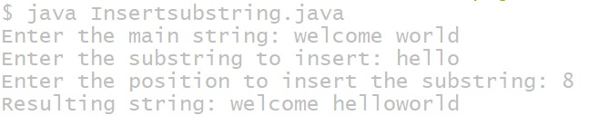
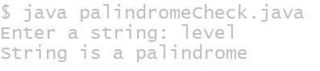

## Additional Experiments
## TITLE:1) Program to insert sub string into a main string from a given position.
```
import java.util.Scanner;

public class InsertSubstring {
    public static void main(String[] args) {
        Scanner sc = new Scanner(System.in);

        // Input main string
        System.out.print("Enter the main string: ");
        String mainString = sc.nextLine();

        // Input substring
        System.out.print("Enter the substring to insert: ");
        String subString = sc.nextLine();

        // Input position
        System.out.print("Enter the position to insert the substring: ");
        int position = sc.nextInt();

        // Check valid position
        if (position < 0 || position > mainString.length()) {
            System.out.println("Invalid position!");
        } else {
            // Extract parts of the main string
            String firstPart = mainString.substring(0, position);
            String secondPart = mainString.substring(position);

            // Insert substring
            String resultString = firstPart + subString + secondPart;

            // Display result
            System.out.println("Resulting string: " + resultString);
        }

        sc.close();
    }
}
```
## output

## TITLE:3) Program to determine if a given string is palindrome or not.
```
import java.util.Scanner;

public class PalindromeCheck {
    public static void main(String[] args) {
        Scanner sc = new Scanner(System.in);

        // Input string
        System.out.print("Enter a string: ");
        String str = sc.nextLine();

        // Initialize pointers
        int start = 0;
        int end = str.length() - 1;

        boolean isPalindrome = true;

        // Compare characters from both ends
        while (start < end) {
            if (str.charAt(start) != str.charAt(end)) {
                isPalindrome = false;
                break;
            }
            start++;
            end--;
        }

        // Display result
        if (isPalindrome) {
            System.out.println("String is a palindrome");
        } else {
            System.out.println("String is not a palindrome");
        }

        sc.close();
    }
}
```
## output

## TITLE:4) Program to check if a number is a perfect number.
```
import java.util.Scanner;

public class PerfectNumber {
    public static void main(String[] args) {
        Scanner sc = new Scanner(System.in);

        // Input number
        System.out.print("Enter a positive integer: ");
        int num = sc.nextInt();

        int sum = 0;

        // Find sum of proper divisors
        for (int i = 1; i <= num - 1; i++) {
            if (num % i == 0) {
                sum = sum + i;
            }
        }

        // Check perfect number
        if (sum == num) {
            System.out.println(num + " is a perfect number");
        } else {
            System.out.println(num + " is not a perfect number");
        }

        sc.close();
    }
}
```
## Output

