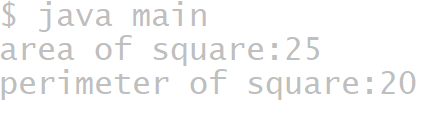

## Experiment-2
## Title:2a.) Implements class mechanisms in java.
```
class square {
  int length;
  int areaofsquare(){
     return length*length;
  }
  int perimeterofsquare(){
     return 4*length;
  }
}
class main {
  public static void main(String arg[]){
  square sq=new square();
  sq.length=5;
  int area = sq.areaofsquare();
  int perimeter = sq.perimeterofsquare();
  System.out.println("area of square:"+area);
  System.out.println("perimeter of square:"+perimeter);
  }
}
```
## output

